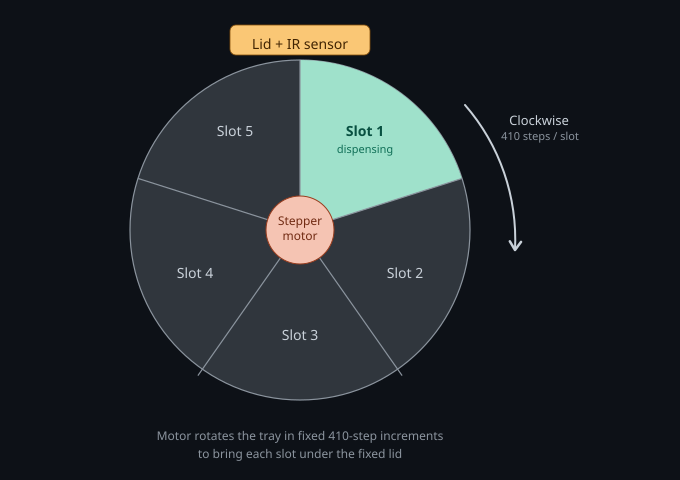
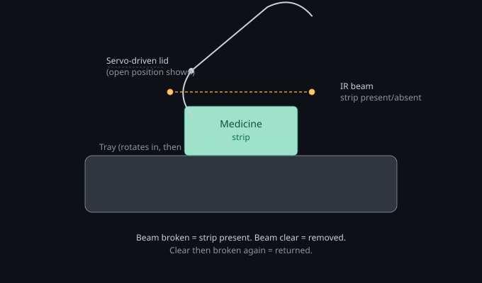

# MedCare IoT : A Smart Automatic Medicine Dispenser

<br>

<p align="center">
  &nbsp;
  &nbsp;
  &nbsp;
  &nbsp;
</p>

---

## Overview

**MedCare IoT** is an IoT-based smart medicine dispenser designed specifically for visually impaired and elderly patients. It autonomously dispenses the correct medicine at scheduled times, provides audio guidance throughout the process, and enables remote caregiver monitoring through a Flutter Android app connected to Firebase. The system combines an ESP32-powered medicine dispenser with a Flutter and Firebase mobile application, allowing the dispenser to rotate through medicine slots according to a predefined schedule, dispense medication at the correct time, provide voice guidance, and keep caregivers informed in real time, even when they are away from home.

> "Empowering blind patients to manage their daily medicines independently — safely, accurately, and on time."

---
## App Screenshots
<p align="center">
  
  
  
  
  
</p>


## Project Structure

```text
medcare_app/
├── android/
│   ├── app/
│   │   ├── google-services.json
│   │   ├── build.gradle.kts
│   │   └── src/                    
│   ├── gradle/                     
│   ├── build.gradle.kts
│   └── settings.gradle.kts
│
├── assets/
│   └── icons/
│ 
│      └── google.png
├── functions/
│   ├── index.js
│   ├── package-lock.json
│   └── package.json
│
├── lib/
│   ├── models/
│   │   ├── app_notification.dart
│   │   ├── caregiver.dart
│   │   ├── device_event.dart
│   │   ├── device_settings.dart
│   │   ├── device_status.dart
│   │   ├── schedule_entry.dart
│   │   └── slot.dart
│   │
│   ├── screens/
│   │   ├── account_management_screen.dart
│   │   ├── caregiver_screen.dart
│   │   ├── dashboard_screen.dart
│   │   ├── history_screen.dart
│   │   ├── login_screen.dart
│   │   ├── schedule_screen.dart
│   │   ├── settings_screen.dart
│   │   ├── slot_editor_screen.dart
│   │   ├── splash_screen.dart
│   │   ├── tray_screen.dart
│   │   ├── username_setup_screen.dart
│   │   ├── about_screen.dart
│   │   ├── privacy_policy_screen.dart
│   │   ├── tray_screen.dart
│   │   └── username_setup_screen.dart
│   │
│   ├── services/
│   │   ├── auth_service.dart
│   │   ├── firebase_service.dart
│   │   ├── notification_service.dart
│   │   └── push_notification_service.dart
│   │
│   ├── state/
│   │   └── app_state.dart
│   │
│   ├── theme/
│   │   └── app_colors.dart
│   │
│   ├── widgets/
│   │   ├── app_toast.dart
│   │   ├── medicine_card.dart
│   │   ├── side_menu.dart
│   │   ├── status_bar_style.dart
│   │   ├── status_dot.dart
│   │   ├── theme_reveal.dart
│   │   └── tray_painter.dart
│   │
│   ├── app_root.dart
│   ├── auth_gate.dart
│   ├── config.dart
│   ├── firebase_options.dart
│   └── main.dart
│   
├── firebase.json
├── pubspec.yaml
└── README.md
```

##  Features

### Medicine Dispenser

| Feature | Description |
|---|---|
| **Pentagon Drum** | 5-compartment rotating drum driven by 28BYJ-48 stepper motor |
| **Audio Guidance** | Announces medicine name, dose, instructions, and guides the user through every step via DFPlayer Mini |
| **RFID Verification** | RFID card recognition for caregiver identification and medicine identity verification |
| **FC-51 IR Detection** | Detects medicine removal and strip return before closing the lid |
| **360° Servo Lid** | Automatically opens and closes the lid, keeping it open until the medicine strip is returned with a 2-second finger safety delay |
| **Period Scheduling** | Supports Morning, Lunch, Night, and Exact Time scheduling modes with up to 3 schedules per slot |
| **Multi-Medicine Queue** | Dispenses 3–4 medicines due at the same time sequentially in a single session |
| **Buzzer Feedback** | Provides audio and buzzer feedback for system actions, making the device accessible without sight |
| **Physical Button Control** | Short press checks or dispenses due medicine, while long press enters refill mode |
| **Offline-First Operation** | Schedules and slot configuration are cached locally in NVS flash storage so the dispenser continues working without WiFi |
| **NVS Recovery** | Configuration and medicine data are stored in flash memory and survive power cuts or unexpected restarts |
| **Stock Tracking** | Automatically tracks medicine stock levels and provides low-stock and critical-stock alerts |
| **NTP Time Sync** | Periodically synchronizes the DS3231 RTC with internet time using the Asia/Dhaka timezone |
| **RTC Backup** | Maintains accurate scheduling through the DS3231 RTC even when internet connectivity is unavailable |
| **Firebase Sync** | Receives schedule and configuration updates from Firebase Realtime Database within seconds |

<br>

### Flutter Mobile App

| Feature | Description |
|---|---|
| **Medicine Slot Setup** | Configure medicine name, dose, slot, RFID, stock, and other medicine information |
| **Schedule Management** | Create and manage Morning, Lunch, Night, and Exact Time schedules |
| **Multiple Schedules** | Supports up to 3 schedules for each medicine slot |
| **Dashboard** | View today's medication schedule at a glance, including taken and pending doses |
| **Tray View** | Visualize the status of all 5 medicine slots |
| **Schedule Editor** | Add and edit dosing schedules for each medicine slot |
| **Firebase Integration** | Synchronizes medicine schedules, configuration, and dispenser data with the ESP32 through Firebase Realtime Database |
| **Real-Time Updates** | Changes made from the app are synchronized with the dispenser within seconds |
| **Dispensing History** | Records and displays taken, missed, refilled, and other dispensing activity |
| **Stock Monitoring** | Monitors medicine stock levels and provides low-stock and critical-stock alerts |
| **Refill Mode** | Allows caregivers to update medicine stock when refilling the dispenser |
| **Remote Monitoring** | Allows caregivers to remotely monitor dispenser activity, medication status, schedules, and stock |
| **Caregiver Management** | Supports multiple caregivers sharing one dispenser, with individual caregiver profiles and remote access |
| **Push Notifications** | Sends missed-dose, low-stock, critical-stock, and “due in 20 minutes” notifications, including when the app is closed |
| **Offline-Aware Operation** | Displays cached data when connectivity is lost and provides a clear connection-status indicator |
| **Robust Sign-In State** | Safely restores signed-in sessions after app restart and prevents unnecessary caregiver sign-out while offline, avoiding stale FCM push tokens |
| **Light/Dark Theme** | Supports light and dark themes with an animated reveal transition |
---


## System Architecture

```
┌─────────────────────────────────────────────────────────────┐
│                        FLUTTER APP                          │
│   Dashboard │ Setup │ History │ Caregiver │ ML Insights     │
└──────────────────────────┬──────────────────────────────────┘
                           │ Read / Write
                           ▼
┌─────────────────────────────────────────────────────────────┐
│                   FIREBASE REALTIME DB                      │
│  /dispensers/dispenser_01/                                  │
│    ├── slots/       ← schedule config (app writes)          │
│    ├── events/      ← dose history  (ESP32 writes)          │
│    ├── status/      ← device online (ESP32 writes)          │
│    └── command      ← remote control (app writes)           |
│                          +                                  │
│                     Cloud Messaging                         │
│                          +                                  │ 
│                   Cloud Functions                           │
└──────────────────────────┬──────────────────────────────────┘
                           │ SSE Stream + REST
                           ▼
┌─────────────────────────────────────────────────────────────┐
│                      ESP32 FIRMWARE                         │
│  State Machine │ Queue │ Period Scheduler │ NTP │ NVS       │
└──────┬──────────┬──────────┬──────────┬──────────┬──────────┘
       │          │          │          │          │
    Stepper     Servo      FC-51       RFID     DFPlayer
    (Drum)      (Lid)   (Detection)  (Verify)    (Audio)
```


- The firmware and app never talk to each other directly — Firebase Realtime Database is the single source of truth, with the ESP32 subscribed to a live stream (SSE) for instant updates.
- Cloud Functions bridge database events to push notifications via Firebase Cloud Messaging (FCM).


---


## Hardware Wiring

#### ESP32 Pin Assignment

```
ESP32 GPIO  │  Component Pin          │  Notes
────────────┼─────────────────────────┼────────────────────────────────────────────────────────────
GPIO 26     │  ULN2003 IN1            │  Stepper coil A
GPIO 27     │  ULN2003 IN2            │  Stepper coil B
GPIO 14     │  ULN2003 IN3            │  Stepper coil C
GPIO 12     │  ULN2003 IN4            │  Stepper coil D
            │  ULN2003 VCC → 5V       │
            │  ULN2003 GND → GND      │
            │  28BYJ-48 connector     │  Plug directly into ULN2003
────────────┼─────────────────────────┼────────────────────────────────────────────────────────────
GPIO 25     │  SG90 Signal (orange)   │  Lid servo
            │  SG90 VCC   → 5V        │
            │  SG90 GND   → GND       │
────────────┼─────────────────────────┼────────────────────────────────────────────────────────────
GPIO 21     │  DS3231 SDA             │  I2C data (shared)
GPIO 22     │  DS3231 SCL             │  I2C clock (shared with RFID RST → use 22 for RFID RST)
            │                         │
            |                         │
            │  DS3231 VCC → 3.3V      │
            │  DS3231 GND → GND       │
────────────┼─────────────────────────┼────────────────────────────────────────────────────────────
GPIO 34     │  IR Alignment OUT       │  INPUT_ONLY pin; HIGH = slot aligned
GPIO 35     │  IR Break-Beam OUT      │  INPUT_ONLY pin; LOW = beam broken (medicine taken)
            │  IR sensors VCC → 5V    │
            │  IR sensors GND → GND   │
────────────┼─────────────────────────┼────────────────────────────────────────────────────────────
GPIO 4      │  NPN Base (via 1kΩ)     │  Vibration motor driver
            │  NPN Collector → Vib(+) │
            │  NPN Emitter → GND      │
            │  Vib Motor (+) → 3.3V   │  via collector
────────────┼─────────────────────────┼────────────────────────────────────────────────────────────
GPIO 16     │  DFPlayer Mini RX       │  ESP TX → DFPlayer RX
GPIO 17     │  DFPlayer Mini TX       │  DFPlayer TX → ESP RX
            │  DFPlayer VCC → 5V      │  Add 100µF cap across power pins
            │  DFPlayer GND → GND     │
            │  DFPlayer SPK+ →Speaker+│
            │  DFPlayer SPK- →Speaker-│
────────────┼─────────────────────────┼────────────────────────────────────────────────────────────
GPIO 5      │  MFRC522 SDA/SS         │  SPI chip select
GPIO 18     │  MFRC522 SCK            │  SPI clock
GPIO 23     │  MFRC522 MOSI           │  SPI MOSI
GPIO 19     │  MFRC522 MISO           │  SPI MISO
GPIO 22     │  MFRC522 RST            │  Reset (share GPIO 22 carefully)
            │  MFRC522 VCC → 3.3V     │  NOT 5V — will damage chip
            │  MFRC522 GND → GND      │
────────────┼─────────────────────────┼────────────────────────────────────────────────────────────
GPIO 0      │  Push Button → GND      │  Internal pull-up enabled in code
────────────┼─────────────────────────┼────────────────────────────────────────────────────────────
5V / 3.3V   │  As labelled above      │  Separate 5V for motors
GND         │  Common ground          │  All GND tied together
```

> ⚠️ **MFRC522 & DS3231 RST/SCL conflict**: DS3231 SCL uses GPIO 22, and MFRC522 RST also uses GPIO 22 in the default code. In practice, since SCL is I2C and RST is a digital output used only at init..

---


## Dispensing Mechanism

### Circular Tray


The dispenser holds 5 medicine slots on a single rotating tray, driven by a stepper motor. Only one slot is ever open at a time — the tray rotates a fixed number of steps to bring the next due slot under a stationary lid and sensor assembly.



### Compartment Notch Detection

Once a slot arrives at the dispensing position, the servo-driven lid swings open and an IR sensor beam across the opening tracks the medicine strip's state — this is what lets the firmware know the strip was actually taken (not just that the lid opened), and later confirms it was put back before closing.

This sensor sequence maps directly onto the firmware's dispensing state machine: `STATE_LID_OPEN_WAITING` (beam broken, strip still there) → `STATE_STRIP_TAKEN` (beam clears) → `STATE_SAFETY_DELAY` (beam breaks again, strip returned) → `STATE_CLOSING_LID`.

Steps per compartment with 28BYJ-48 in half-step mode:
- Full revolution = 2048 steps (half-step)
- Per slot = 2048 / 5 =~ **410 steps**


<br><br>




### Lid Mechanism

- SG90 servo arm connected to a simple hinged flap over the dispensing window
- **0°** = closed and locked
- **90°** = fully open, user can reach in
- Slow sweep (5° increments, 15ms delay) avoids jerking

---


##  Dispense Flow

```
RTC triggers schedule OR patient presses button
              ↓
Drum rotates to correct compartment
              ↓
Lid opens — medicine name announced
              ↓
Patient optionally taps RFID card → name confirmed
              ↓
Patient removes strip (FC-51 detects HIGH)
Medicine name announced again
              ↓
Patient returns strip (FC-51 detects LOW)
"Closing in 2 seconds — remove fingers"
2-second safety delay
              ↓
Lid closes slowly
Event logged to Firebase
              ↓
If more medicines queued → next medicine announced
              ↓
After all done → drum returns to slot 0
"All medicines taken, well done"
```

---

## Refill Mode Flow

```
Long press button (3s)
              ↓
Drum rotates to slot 0 → Lid opens → stays open
Audio: "Compartment open, please refill"
              ↓
OPTION A: Remove old strip → insert new strip
          FC-51 detects sequence → auto-advances
OPTION B: Short button press → manually advance
              ↓
2-second safety delay → lid closes → next slot opens
              ↓
Repeat for all 5 slots
              ↓
Long press at any point → exit refill mode early
```


## 🗄️ Firebase Database Structure

```json
/dispensers/dispenser_01/
  ├── slots/
  │   └── 0/
  │       ├── medicineName: "Metformin"
  │       ├── dose: "500mg"
  │       ├── quantity: 30
  │       ├── enabled: true
  │       ├── numSchedules: 2
  │       └── schedules/
  │           ├── [0]: { period: 0, hour: 8,  minute: 0, takenToday: false }
  │           └── [1]: { period: 2, hour: 20, minute: 0, takenToday: false }
  ├── events/
  │   └── -NxAbc/
  │       ├── type: "medicine_taken"
  │       ├── slot: 0
  │       ├── name: "Metformin"
  │       ├── status: "taken"
  │       └── timestamp: "2025-01-01 08:05"
  ├── status/
  │   ├── online: true
  │   ├── lastSeen: "2025-01-01 08:05"
  │   ├── wifi_rssi: -65
  │   ├── currentSlot: 0
  │   └── mode: "idle"
  └── command: ""
```

---


## Data Flowing

| Topic | Direction | Payload |
|-------|-----------|---------|
| `medcare/commands` | App → Device | JSON: `{cmd, slot, name, hour, minute, ...}` |
| `medcare/events` | Device → App | JSON: `{type, slot, name, status, timestamp}` |
| `medcare/status` | Device → App | JSON: full device state every 60s |


**Set medicine (app → device):**
```json
{
  "cmd": "set_medicine",
  "slot": 2,
  "name": "Vitamin D3",
  "hour": 12,
  "minute": 0,
  "quantity": 30,
  "enabled": true,
  "rfid": false
}
```

**Medicine taken event (device → app):**
```json
{
  "type": "medicine_taken",
  "slot": 2,
  "name": "Vitamin D3",
  "status": "taken",
  "qty": 29,
  "timestamp": "2025-05-16 12:02"
}
```

<h1 align="center">Firmware Setup</h1>
<hr>


### 1. Copy the secrets template and fill in your real values:
   ```bash
   cd medcare_dispenser
   cp secrets.h.example secrets.h
   ```
   Then edit `secrets.h` with your actual Wi-Fi credentials and
   Firebase project details.


### 2. Install Arduino Libraries

Open Arduino IDE → Tools → Manage Libraries → search and install:

| Library | Version | Author |
|---|---|---|
| Firebase ESP32 Client | latest | Mobizt |
| RTClib | ≥ 2.1.1 | Adafruit |
| ESP32Servo | ≥ 0.13.0 | Kevin Harrington |
| DFRobotDFPlayerMini | ≥ 1.0.6 | DFRobot |
| MFRC522 | ≥ 1.4.10 | GithubCommunity |
| ArduinoJson | ≥ 7.0.0 | Benoit Blanchon |


### 3. Configure Credentials

Copy `firmware/credentials.h.example` → `firmware/medcare_dispenser/credentials.h`

Fill in your values:
```cpp
#define WIFI_SSID        "YOUR_WIFI_NAME"
#define WIFI_PASSWORD    "YOUR_WIFI_PASSWORD"
#define FIREBASE_API_KEY "YOUR_WEB_API_KEY"
#define FIREBASE_DB_URL  "your-project-default-rtdb.region.firebasedatabase.app"
#define FIREBASE_USER    "device@yourproject.com"
#define FIREBASE_PASS    "yourpassword"
#define DEVICE_ID        "dispenser_01"
```

### 4. Set Period Windows

| Period | Time Window | Trigger |
|---|---|---|
| Morning | 7:00 AM – 11:59 AM | Fires automatically at 7:00 AM |
| Lunch | 12:00 PM – 4:59 PM | Fires automatically at 12:00 PM |
| Night | 6:00 PM – 11:59 PM | Fires automatically at 6:00 PM |
| Exact | Custom time | Fires at set hour : minute |

---

### 5. SD Card Audio Tracks

**Generate MP3 files:**
1. Go to [This link](https://ttsmaker.com)
2. Type each phrase → Download MP3
3. Rename files exactly as above


Place all files in `/01/` folder on SD card:

| Track | Content |
|---|---|
| 0001 | "System ready" |
| 0002 | "Preparing your medicine, please wait" |
| 0003 | "Please take your medicine now" |
| 0004 | "Medicine taken, thank you" |
| 0005 | "Please return the strip to the compartment" |
| 0006 | "Closing in 2 seconds, please remove fingers" |
| 0007 | "Compartment secured" |
| 0008 | "All medicines taken for today, well done" |
| 0009 | "Correct medicine confirmed" |
| 0010 | "Warning: this is not the scheduled medicine" |
| 0011–0015 | Slot 0–4 medicine names |
| 0016 | "Entering refill mode" |
| 0017 | "Compartment open, please refill" |
| 0018 | "Short press when done, hold to exit" |
| 0019 | "Exiting refill mode" |
| 0020 | "Medicine stock is low, please refill" |
| 0021 | "Reminder: please take your medicine" |
| 0022 | "Please return the medicine strip to the compartment" |
| 0023 | "Next medicine" |
| 0024–0028 | "You have 1–5 medicines to take" |
| 0029 | "Morning medicine time" |
| 0030 | "Lunch medicine time" |
| 0031 | "Night medicine time" |
| 0032 | "You have already taken your medicines for this session" |
| 0033 | "No medicine is scheduled at this time" |
| 0034 | "You have not taken your medicine for this period" |

---

### 6. Button Controls

| Press | Duration | Action |
|---|---|---|
| Short press | < 3 seconds | Dispense due medicines / advance refill slot |
| Long press | ≥ 3 seconds | Enter refill mode / exit refill mode |

---

### 7. Upload

```
Board:     ESP32 Dev Module
Port:      COMx
Upload Speed: 115200
Flash Size: `4MB`
Partition Scheme: `Default 4MB with spiffs`
```

<h1 align="center">Flutter App & Firebase Setup</h1>
<hr>


##  Flutter App Screens

| Screen | Purpose |
|---|---|
| Dashboard | Scheduled Medicine, next dose, device online status |
| Tray | Interactive pentagon diagram showing all slots, Remote controls |
| Setup | Stock alerts, Per slot configuration — name, dose, quantity, schedules |
| History | Event log, Daily adherence chart |
| Caregiver | Profile Management , Caregiver Contacts |

---

### Step 0 : Recommended Environment

- Flutter 3.35.5 (stable) / Dart 3.9.2
- JDK 17.0.12 LTS
- Android SDK 35, build-tools 35.0.0, licenses accepted
- VS Code + Flutter extension 3.138.0

> All compatible with the versions in `pubspec.yaml` Flutter 3.35.5 scaffolds new Android projects with **Kotlin DSL** Gradle files.
---

### Step 1 : Clone the Project

#### # Clone the **MedCare IoT** repository from GitHub:

```bash
git clone <YOUR_GITHUB_REPOSITORY_URL>
cd <PROJECT_FOLDER>
```

#### # Open the project in **Visual Studio Code**:

```bash
code .
```

#### # Make sure the following extensions are installed in VS Code:

* **Flutter**
* **Dart**

#### # Install all required Flutter project dependencies:


```bash
# Check Flutter is installed
flutter --version

# Install FlutterFire CLI
dart pub global activate flutterfire_cli

# In your project folder
flutter pub get
```

> **Important:** The repository already contains the complete Flutter project, including the `lib/` folder and `pubspec.yaml`. You **do not need to create a new Flutter project** or replace any files manually.

---

### Step 2 : Android/Gradle settings

`android/settings.gradle.kts` — the `plugins { }` block should include:
```kotlin
plugins {
    id("dev.flutter.flutter-plugin-loader") version "1.0.0"
    id("com.android.application") version "8.7.0" apply false
    id("org.jetbrains.kotlin.android") version "1.9.24" apply false
    id("com.google.gms.google-services") version "4.4.2" apply false
}
```
<br>

`android/app/build.gradle.kts` file `plugins { }` block:
```kotlin
plugins {
    id("com.android.application")
    id("kotlin-android")
    id("dev.flutter.flutter-gradle-plugin")
    id("com.google.gms.google-services")
}
```
<br>

and `android { defaultConfig { } }`
```kotlin
android {
    namespace = "com.yourname.medcare_app"
    compileSdk = flutter.compileSdkVersion
    ndkVersion = flutter.ndkVersion

    defaultConfig {
        applicationId = "com.yourname.medcare_app"
        minSdk = 23          // override Flutter's default — Firebase needs 23+
        targetSdk = flutter.targetSdkVersion
        versionCode = flutter.versionCode
        versionName = flutter.versionName
    }
}
```
---

### Step 4 : Create Firebase Project

1. Go to https://console.firebase.google.com
2. Click **"Add project"**
3. Name it: `medcare-iot`
4. Disable Google Analytics (optional for research)
5. Click **"Create project"**

---

### Step 5 : Enable Firebase Services

#### a. Realtime Database
1. Left sidebar → **Build → Realtime Database**
2. Click **"Create Database"**
3. Choose region closest to you (e.g. asia-southeast1 for Bangladesh)
4. Start in **"Test mode"** first (we'll add rules later)
5. Copy the database URL — looks like:
   `https://medcare-iot-default-rtdb.asia-southeast1.firebasedatabase.app/`

#### b. Authentication
1. Left sidebar → **Build → Authentication**
2. Click **"Get started"**
3. Go to **"Sign-in method"** tab
4. Enable **"Email/Password"**
5. Go to **"Users"** tab → **"Add user"**
6. Add device user:
   - Email: `device@medcare.com`
   - Password: `deviceSecurePass123`
7. Add caregiver user:
   - Email: `caregiver@medcare.com`
   - Password: (choose strong password)

#### c. Cloud Messaging (FCM for push notifications)
1. Left sidebar → **Build → Cloud Messaging**
2. Already enabled — no action needed
3. Note: Server key is auto-managed by Firebase SDK

---

### Step 6 : Add Android App to Firebase

1. In Firebase Console → Project Overview → click **Android icon**
2. Android package name: `com.medcare.dispenser`
3. App nickname: `MedCare Android`
4. Click **"Register app"**
5. Download `google-services.json`
6. Place it in: `medcare_app/android/app/google-services.json`

---


### Step 7 : Configure Firebase in Flutter

```bash
dart pub global activate flutterfire_cli
flutterfire configure

# When it asks which Firebase project, pick the exact same project
# Select platforms: Android (press space to select, enter to confirm)
# This generates "lib/firebase_options.dart" automatically

```


---

### Step 8 : Apply Firebase Database Rules

1. Firebase Console → Realtime Database → **"Rules"** tab
2. Replace all existing rules with contents of
   `firebase/database.rules.json`
3. Click **"Publish"**

The rules ensure:
- Only authenticated users can read/write
- Data is validated
- No unauthorised access from outside

---

### Step 9 : Set Up Database Structure

In Firebase Console → Realtime Database → click the **+** button
and create this initial structure manually or let device create it:

```
dispensers/
  dispenser_01/
    slots/
      0/
        medicineName: "Medicine 1"
        dose: "—"
        hour: 8
        minute: 0
        quantity: 0
        enabled: false
        rfidRequired: false
        takenToday: false
      1/  (same structure)
      2/  (same structure)
      3/  (same structure)
      4/  (same structure)
    status/
      online: false
      lastSeen: "—"
    command: ""
```

### Step 10 : Deploy Cloud Functions
```bash
cd medcare_app/functions
npm install
firebase deploy --only functions
```

---

### Step 11 : Update ESP32 Firmware Config

**Finding Firebase API Key:**
- Firebase Console → ⚙ Project Settings → General tab
- Scroll down to "Your apps" → Web app section
- Copy `apiKey` value

---

### Step 12 : Build and Run Flutter App

```bash
# Connect Android phone with USB debugging ON
# Enable USB debugging: Settings → Developer Options → USB Debugging

# Check device is detected
flutter devices

# Run in debug mode
flutter run

# Build release APK
flutter build apk --release

# APK location after build:
# build/app/outputs/flutter-apk/app-release.apk
```

---


### TROUBLESHOOTING

| Problem | Solution |
|---|---|
| `firebase_options.dart` not found | Run `flutterfire configure` |
| Build fails: minSdkVersion | Open `android/app/build.gradle` → set `minSdkVersion 23` |
| Push notifications not received | Check `google-services.json` is in `android/app/` |
| ESP32 Firebase auth fails | Check API key and DB URL exactly match Firebase Console |
| DFPlayer no sound | Check SD card is FAT32, files in `/01/` folder |
| RFID not reading | Confirm MFRC522 VCC is 3.3V not 5V |
| Stepper not rotating | Check ULN2003 IN1-IN4 match GPIO 26,27,14,12 |
| FC-51 wrong reading | Adjust potentiometer on FC-51 board |

---


## Future ML Features

| Feature | Method |
|---|---|
| Missed dose prediction | Logistic regression on adherence patterns |
| Refill forecasting | Linear regression on consumption rate |
| Adherence analysis | Day/hour frequency heatmap |
| Anomaly detection | Z-score on dose timing |

---

## ⚠️ Known Limitations

- Hall effect sensor for drum position tracking not yet implemented.
- Quantity tracking is manual. Caregiver must update count from app after refill.

