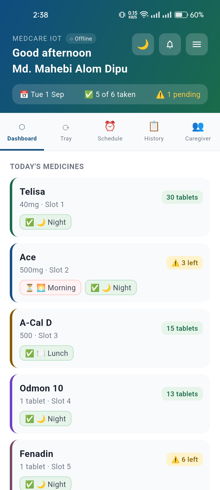
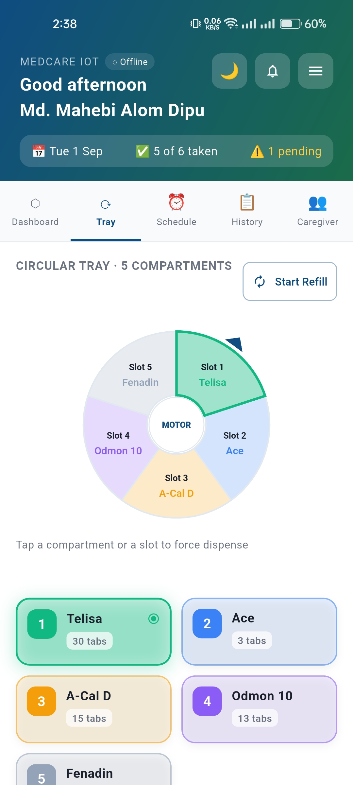
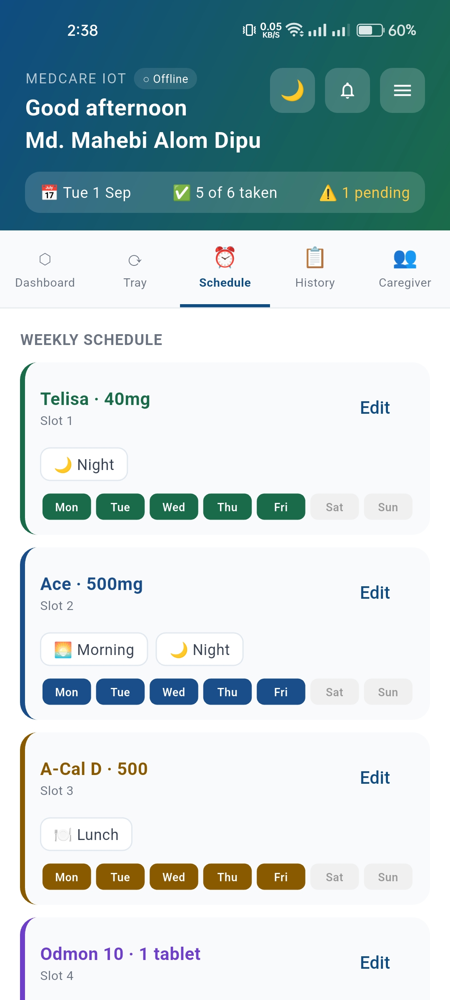
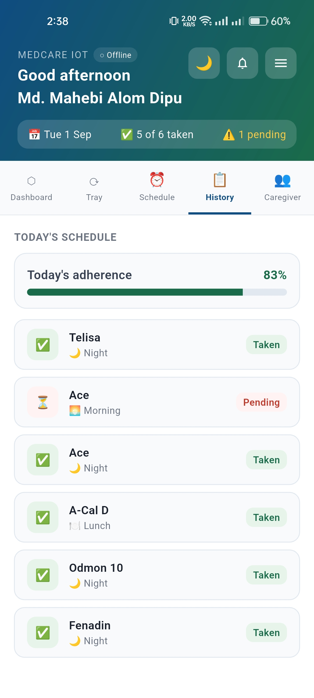
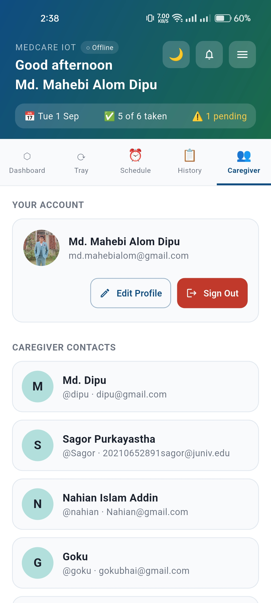
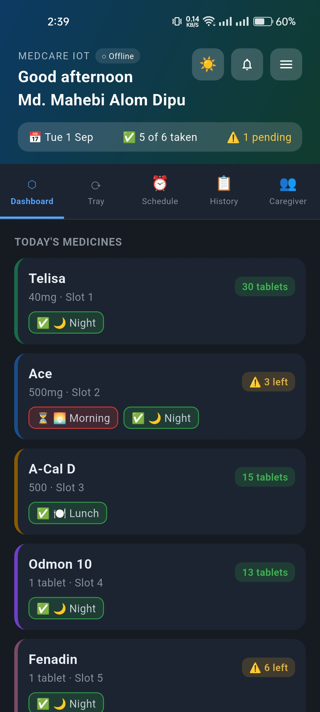
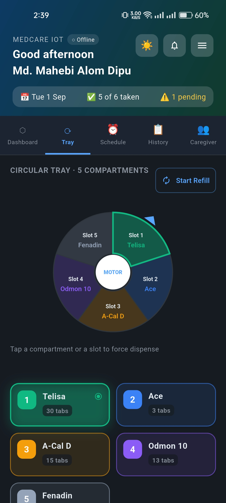
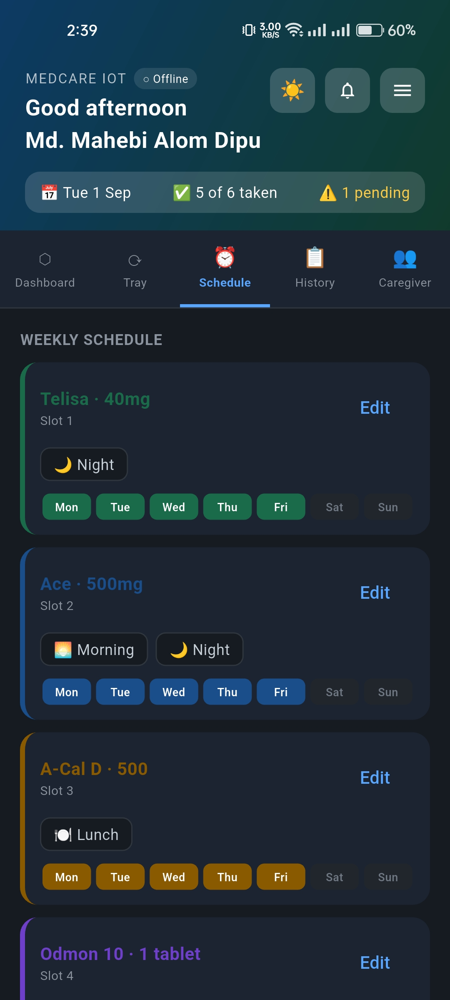
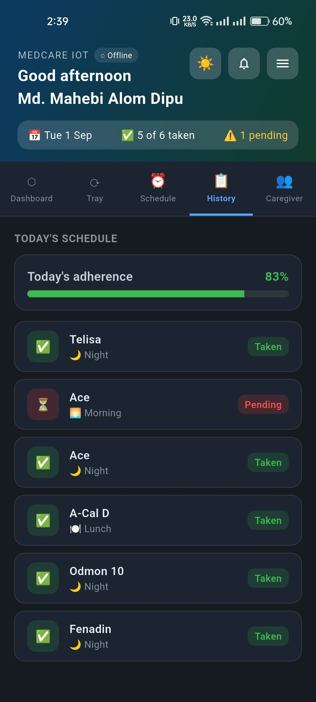
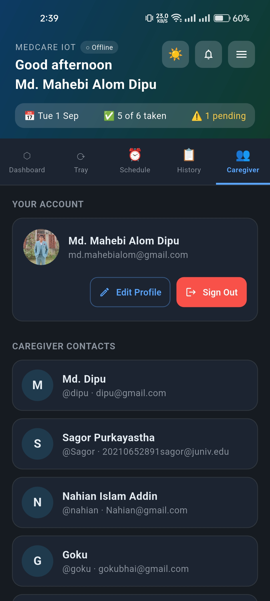

<h1 align="center">Flutter App & Firebase Setup</h1>
<hr>

## App Screenshots
### Light Theme:
<p align="center">
  
  
  
  
  
</p><hr>

### Dark Theme:
<p align="center">
  
  
  
  
  
</p><hr>

##  Flutter App Screens

| Screen | Purpose |
|---|---|
| Dashboard | Scheduled Medicine, next dose, device online status |
| Tray | Interactive pentagon diagram showing all slots, Remote controls |
| Setup | Stock alerts, Per slot configuration — name, dose, quantity, schedules |
| History | Event log, Daily adherence chart |
| Caregiver | Profile Management , Caregiver Contacts |

---

### Step 0 : Recommended Environment

- Flutter 3.35.5 (stable) / Dart 3.9.2
- JDK 17.0.12 LTS
- Android SDK 35, build-tools 35.0.0, licenses accepted
- VS Code + Flutter extension 3.138.0

> All compatible with the versions in `pubspec.yaml` Flutter 3.35.5 scaffolds new Android projects with **Kotlin DSL** Gradle files.
---

### Step 1 : Clone the Project

#### # Clone the **MedCare IoT** repository from GitHub:

```bash
git clone <YOUR_GITHUB_REPOSITORY_URL>
cd <PROJECT_FOLDER>
```

#### # Open the project in **Visual Studio Code**:

```bash
code .
```

#### # Make sure the following extensions are installed in VS Code:

* **Flutter**
* **Dart**

#### # Install all required Flutter project dependencies:


```bash
# Check Flutter is installed
flutter --version

# Install FlutterFire CLI
dart pub global activate flutterfire_cli

# In your project folder
flutter pub get
```

> **Important:** The repository already contains the complete Flutter project, including the `lib/` folder and `pubspec.yaml`. You **do not need to create a new Flutter project** or replace any files manually.

---

### Step 2 : Android/Gradle settings

`android/settings.gradle.kts` — the `plugins { }` block should include:
```kotlin
plugins {
    id("dev.flutter.flutter-plugin-loader") version "1.0.0"
    id("com.android.application") version "8.7.0" apply false
    id("org.jetbrains.kotlin.android") version "1.9.24" apply false
    id("com.google.gms.google-services") version "4.4.2" apply false
}
```
<br>

`android/app/build.gradle.kts` file `plugins { }` block:
```kotlin
plugins {
    id("com.android.application")
    id("kotlin-android")
    id("dev.flutter.flutter-gradle-plugin")
    id("com.google.gms.google-services")
}
```
<br>

and `android { defaultConfig { } }`
```kotlin
android {
    namespace = "com.yourname.medcare_app"
    compileSdk = flutter.compileSdkVersion
    ndkVersion = flutter.ndkVersion

    defaultConfig {
        applicationId = "com.yourname.medcare_app"
        minSdk = 23          // override Flutter's default — Firebase needs 23+
        targetSdk = flutter.targetSdkVersion
        versionCode = flutter.versionCode
        versionName = flutter.versionName
    }
}
```
---

### Step 4 : Create Firebase Project

1. Go to https://console.firebase.google.com
2. Click **"Add project"**
3. Name it: `medcare-iot`
4. Disable Google Analytics (optional for research)
5. Click **"Create project"**

---

### Step 5 : Enable Firebase Services

#### a. Realtime Database
1. Left sidebar → **Build → Realtime Database**
2. Click **"Create Database"**
3. Choose region closest to you (e.g. asia-southeast1 for Bangladesh)
4. Start in **"Test mode"** first (we'll add rules later)
5. Copy the database URL — looks like:
   `https://medcare-iot-default-rtdb.asia-southeast1.firebasedatabase.app/`

#### b. Authentication
1. Left sidebar → **Build → Authentication**
2. Click **"Get started"**
3. Go to **"Sign-in method"** tab
4. Enable **"Email/Password"**
5. Go to **"Users"** tab → **"Add user"**
6. Add device user:
   - Email: `device@medcare.com`
   - Password: `deviceSecurePass123`
7. Add caregiver user:
   - Email: `caregiver@medcare.com`
   - Password: (choose strong password)

#### c. Cloud Messaging (FCM for push notifications)
1. Left sidebar → **Build → Cloud Messaging**
2. Already enabled — no action needed
3. Note: Server key is auto-managed by Firebase SDK

---

### Step 6 : Add Android App to Firebase

1. In Firebase Console → Project Overview → click **Android icon**
2. Android package name: `com.medcare.dispenser`
3. App nickname: `MedCare Android`
4. Click **"Register app"**
5. Download `google-services.json`
6. Place it in: `medcare_app/android/app/google-services.json`

---


### Step 7 : Configure Firebase in Flutter

```bash
dart pub global activate flutterfire_cli
flutterfire configure

# When it asks which Firebase project, pick the exact same project
# Select platforms: Android (press space to select, enter to confirm)
# This generates "lib/firebase_options.dart" automatically

```


---

### Step 8 : Apply Firebase Database Rules

1. Firebase Console → Realtime Database → **"Rules"** tab
2. Replace all existing rules with contents of
   `firebase/database.rules.json`
3. Click **"Publish"**

The rules ensure:
- Only authenticated users can read/write
- Data is validated
- No unauthorised access from outside

---

### Step 9 : Set Up Database Structure

In Firebase Console → Realtime Database → click the **+** button
and create this initial structure manually or let device create it:

```
dispensers/
  dispenser_01/
    slots/
      0/
        medicineName: "Medicine 1"
        dose: "—"
        hour: 8
        minute: 0
        quantity: 0
        enabled: false
        rfidRequired: false
        takenToday: false
      1/  (same structure)
      2/  (same structure)
      3/  (same structure)
      4/  (same structure)
    status/
      online: false
      lastSeen: "—"
    command: ""
```

### Step 10 : Deploy Cloud Functions
```bash
cd medcare_app/functions
npm install
firebase deploy --only functions
```

---

### Step 11 : Update ESP32 Firmware Config

**Finding Firebase API Key:**
- Firebase Console → ⚙ Project Settings → General tab
- Scroll down to "Your apps" → Web app section
- Copy `apiKey` value

---

### Step 12 : Build and Run Flutter App

```bash
# Connect Android phone with USB debugging ON
# Enable USB debugging: Settings → Developer Options → USB Debugging

# Check device is detected
flutter devices

# Run in debug mode
flutter run

# Build release APK
flutter build apk --release

# APK location after build:
# build/app/outputs/flutter-apk/app-release.apk
```

---


### TROUBLESHOOTING

| Problem | Solution |
|---|---|
| `firebase_options.dart` not found | Run `flutterfire configure` |
| Build fails: minSdkVersion | Open `android/app/build.gradle` → set `minSdkVersion 23` |
| Push notifications not received | Check `google-services.json` is in `android/app/` |
| ESP32 Firebase auth fails | Check API key and DB URL exactly match Firebase Console |
| DFPlayer no sound | Check SD card is FAT32, files in `/01/` folder |
| RFID not reading | Confirm MFRC522 VCC is 3.3V not 5V |
| Stepper not rotating | Check ULN2003 IN1-IN4 match GPIO 26,27,14,12 |
| FC-51 wrong reading | Adjust potentiometer on FC-51 board |

